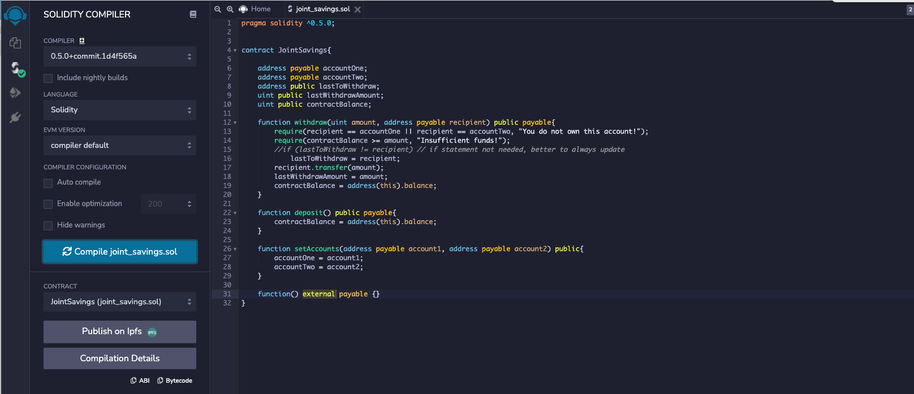
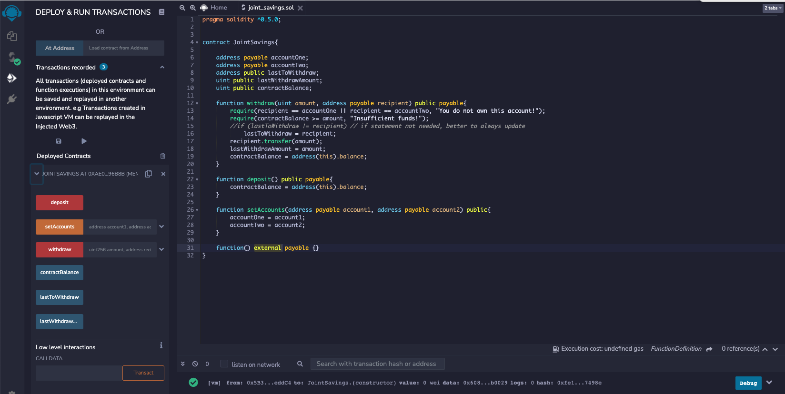
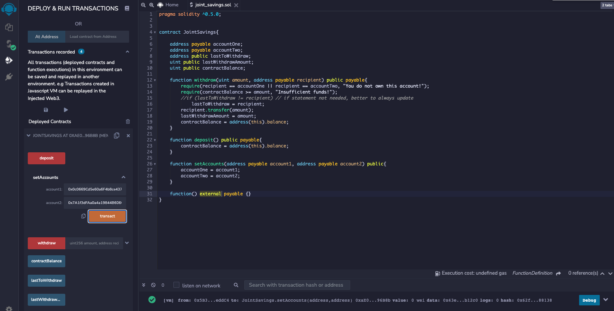
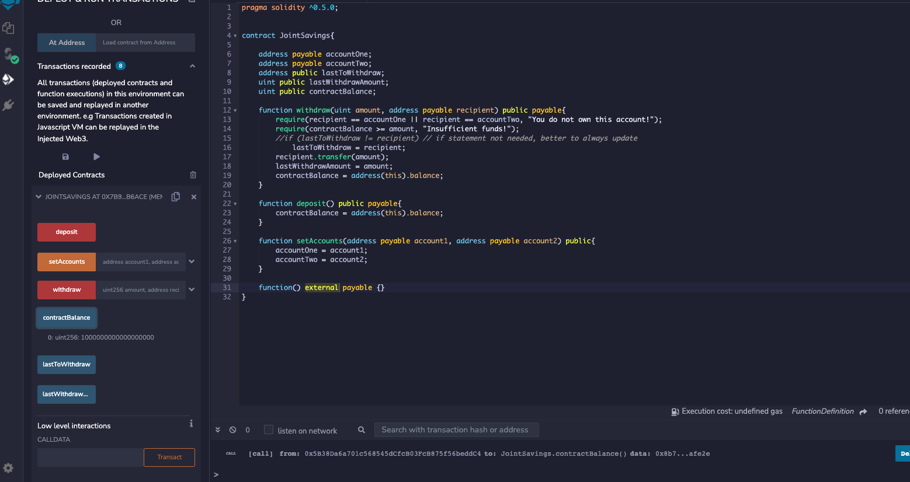
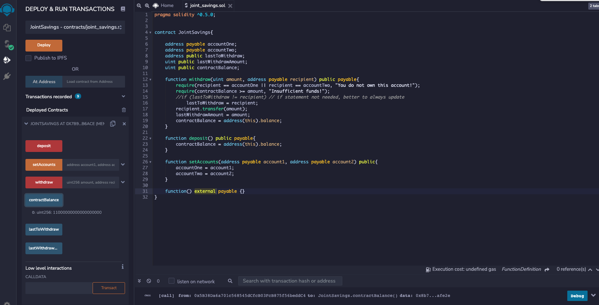
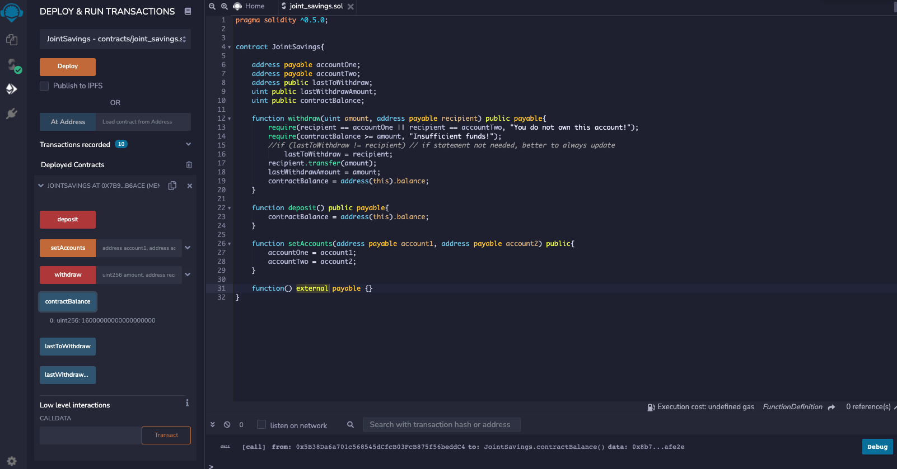
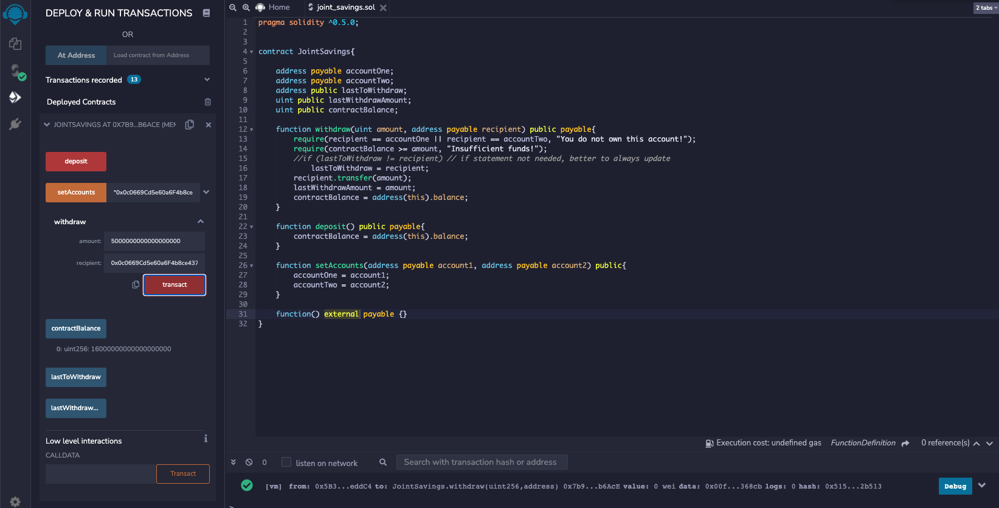
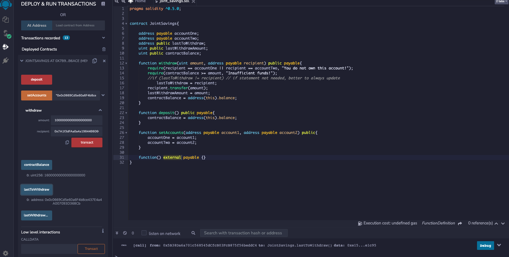
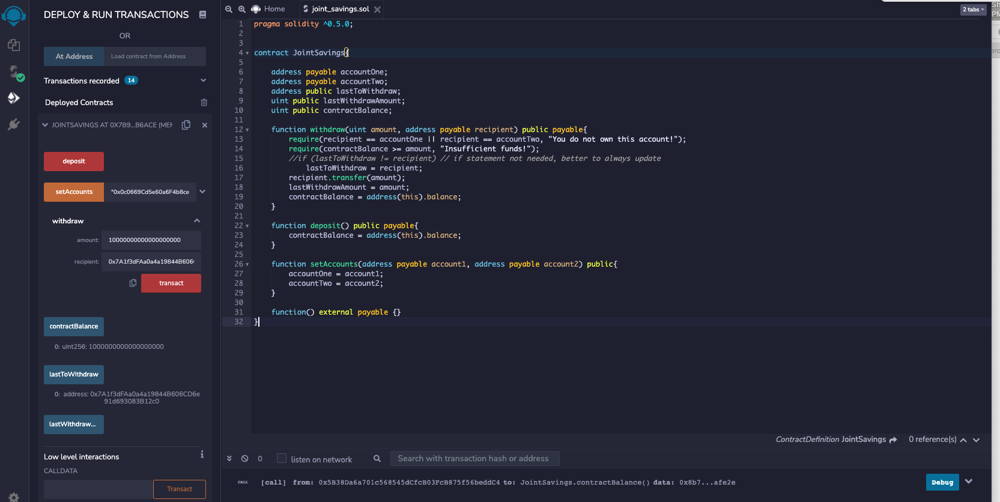

### Compiled the contract

### Deployed the contract on Javascript VM

### Set the two accounts of contract

### Deposit of 1 ether in wei

### Deposit of 10 ether in wei

### Deposit of 5 ether in ether

### Withdraw of 5 ether to account one

### Withdraw of 10 ether

### Final account balance (1 ether)

