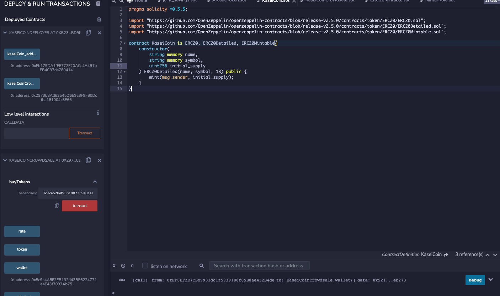
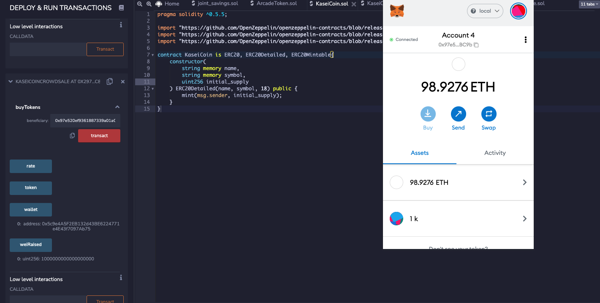
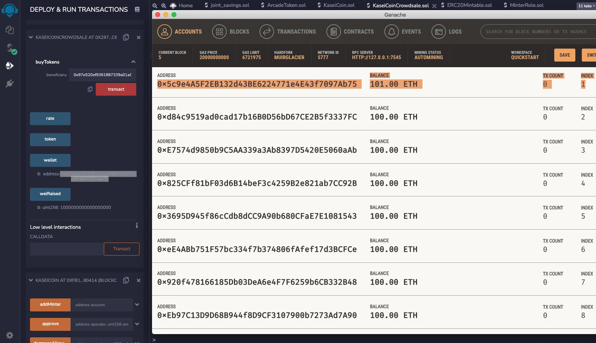
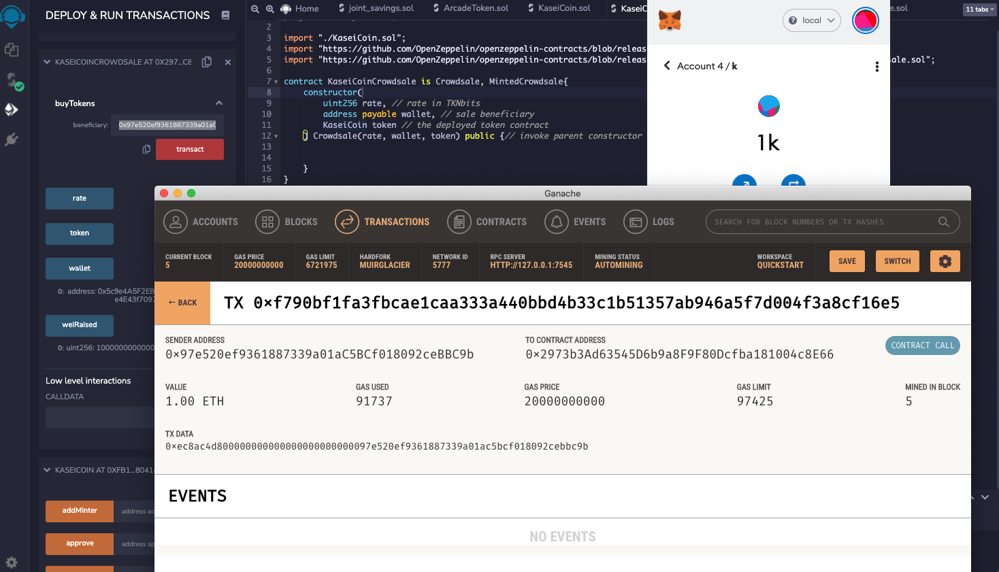

### Below you can see the token contracts code, and the instance of the Deployer and Crowdsale contracts

### Confirmation that the token was sent to the correct account
- The name of the token is "k" and the symbol is "k". 

## Highlited here you can see the crowdsale beneficiary account
- Received 1 Eth

Shows the crowdsales account receiving the 1 Ether. It was sent from the MetaMask account that has 1 KaseiCoin.

